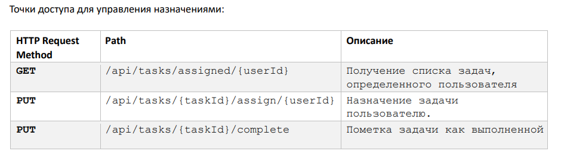
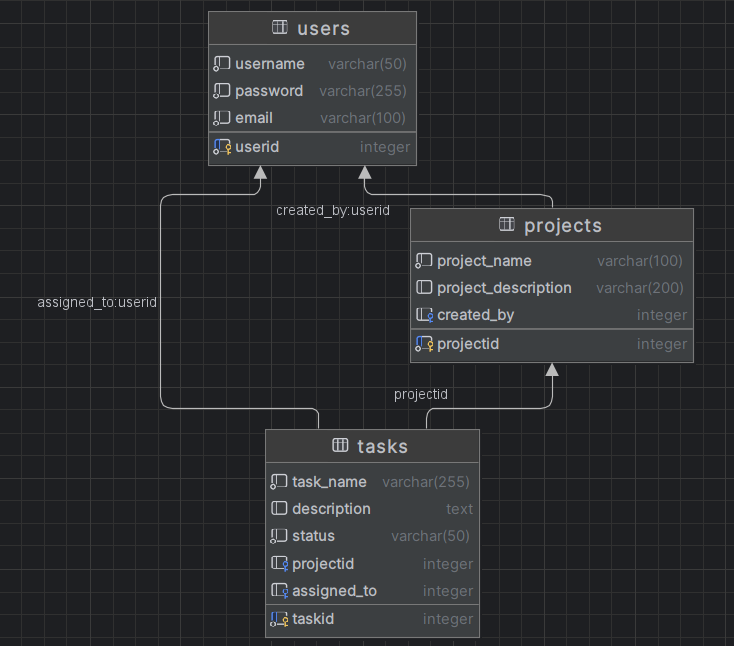

# ToDo in assignement features

develop features for:

after this:
Поиск и фильтрация: Реализуйте функции поиска и фильтрации, чтобы пользователи могли находить конкретные
проекты или задачи на основе критериев, таких как название, статус или диапазон дат.

finally: Autotests

Optional: Frontend

### **Structure of database**

